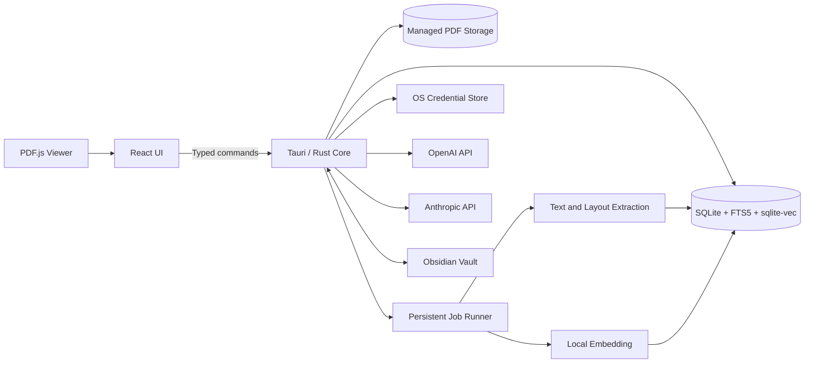
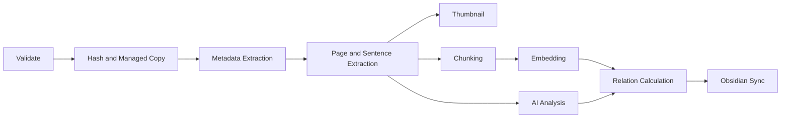

# Bbrain 개발 명세서

> 문서 상태: Draft v1.0  
> 최종 수정일: 2026-07-14  
> 지원 플랫폼: macOS, Windows  
> 기본 언어: 한국어, 설정에서 변경 가능  
> 디자인 기준: [`DESIGN.md`](./DESIGN.md)

## 1. 문서 목적

이 문서는 **Bbrain v1**의 제품 요구사항과 기술 설계를 정의하는 단일 기준 문서다. 구현 범위, 주요 사용자 경험, 시스템 구조, 데이터 계약, AI/RAG 처리 방식, Obsidian 동기화 정책과 완료 조건을 포함한다.

문서 간 내용이 충돌하면 다음 우선순위를 적용한다.

1. 이 문서의 데이터 안전 및 보안 요구사항
2. 이 문서의 기능 및 인수 조건
3. `DESIGN.md`의 시각·인터랙션 규칙
4. 이후 저장소에 추가되는 구현 세부 규칙

## 2. 제품 개요

Bbrain은 개인이 보유한 논문을 수집하고 읽으며, AI 요약·번역·RAG·Obsidian 연동을 통해 재사용 가능한 연구 지식베이스로 만드는 로컬 우선 데스크톱 앱이다.

단순한 파일 관리자나 일회성 Chat with PDF가 아니라, 지속적으로 성장하는 개인 연구용 제2의 뇌를 지향한다.

### 2.1 제품 목표

- 여러 논문을 빠르게 가져오고 그룹·태그로 정리한다.
- 앱을 벗어나지 않고 원본 PDF를 읽고 하이라이트한다.
- 페이지별 문장 번역과 원문 매칭으로 언어 장벽을 낮춘다.
- 논문의 연구 문제, 요약, 기여점, 방법론, 결과와 한계를 자동 정리한다.
- 모든 논문을 로컬 임베딩해 개인 RAG를 구축한다.
- 검색과 채팅 답변에 논문·페이지 단위 근거를 제공한다.
- 생성된 지식과 관계를 Markdown 및 Obsidian에서도 활용한다.
- 논문, 주석, 임베딩, 채팅 기록을 기본적으로 사용자 기기에 저장한다.

### 2.2 v1 제외 범위

- 모바일, 웹, Linux 버전
- 사용자 계정, 결제, 협업, Bbrain 자체 클라우드 동기화
- Bbrain이 운영하는 AI 프록시 또는 모델 호스팅
- 이미지로만 구성된 스캔 PDF의 OCR
- Zotero 연동과 브라우저 확장 프로그램
- 온라인 논문 탐색, 추천 피드, PDF 자동 다운로드
- Moonlight의 수식·이미지 설명, 스마트 인용, 토론 등 전체 기능 복제
- 실시간 다중 기기 Obsidian 충돌 해결

### 2.3 주요 사용자

수십 개에서 수천 개의 논문을 관리하고, 여러 언어의 논문을 읽으며, 일회성 AI 대화보다 지속 가능한 연구 노트를 원하는 대학원생·연구자·엔지니어·전문가를 대상으로 한다.

## 3. 제품 원칙

1. **로컬 우선:** 외부 AI 호출에 필요한 텍스트를 제외한 데이터는 사용자 기기에 둔다.
2. **유창함보다 근거:** AI 답변은 실제 논문 페이지와 추출 텍스트로 역추적할 수 있어야 한다.
3. **PDF가 중심:** 번역·요약·채팅은 원문 읽기를 보조하며 원문을 대체하지 않는다.
4. **복구 가능한 백그라운드 처리:** 앱 종료나 네트워크 실패로 가져오기 작업이 손상되지 않아야 한다.
5. **사용자 분류 우선:** AI는 태그를 제안할 수 있지만 사용자 그룹을 임의로 변경하지 않는다.
6. **열린 지식 산출물:** 연구 노트는 읽을 수 있는 Markdown과 일반 Obsidian 링크를 사용한다.
7. **차분한 생산성:** UI는 `DESIGN.md`의 제한된 색상, 명확한 계층과 절제된 깊이를 따른다.

## 4. 핵심 성공 흐름

Bbrain v1은 신규 사용자가 개발자 도움 없이 다음 흐름을 완료할 수 있을 때 출시 가능하다.

1. macOS 또는 Windows에 설치하고 실행한다.
2. OpenAI 또는 Anthropic API 키와 모델을 설정한다.
3. 여러 PDF를 드래그 앤 드롭으로 가져온다.
4. AI 분석 중 앱을 종료한 뒤 다시 실행해 작업이 재개되는 것을 확인한다.
5. 논문을 열고 현재 페이지를 번역한다.
6. 번역 문장에 마우스를 올려 원문의 대응 문장을 확인한다.
7. 텍스트를 하이라이트하고 확대·축소 및 재실행 후 같은 위치에 유지되는 것을 확인한다.
8. 라이브러리 전체에 질문하고 모든 출처를 실제 논문 페이지에서 연다.
9. Obsidian Vault를 연결하고 태그나 사용자 노트를 양쪽에서 수정한다.
10. Bbrain과 Obsidian Graph View에서 관련 논문을 탐색한다.

### 4.1 성능 목표

SSD와 16GB RAM을 갖춘 일반적인 개발용 노트북을 기준으로 한다.

- 콜드 스타트: 정상 상태에서 3초 이내
- 1,000개 논문·100,000개 청크 검색: p95 500ms 이내
- 캐시된 라이브러리 화면 이동: 전체 화면 로딩 없이 즉시 반응
- 번역문 hover 후 원문 강조: 페이지 렌더 후 100ms 이내
- PDF 스크롤: 임베딩이나 AI 작업 때문에 지속적으로 메인 스레드가 차단되지 않을 것

## 5. 기술 스택

| 계층 | 선택 | 역할 |
|---|---|---|
| 데스크톱 셸 | Tauri 2 | 창, 권한, 패키징, 네이티브 명령 |
| 프론트엔드 | React + TypeScript + Vite | 라이브러리, 뷰어, 채팅, 그래프, 설정 |
| UI 기반 | Radix UI | 접근 가능한 메뉴, 탭, 다이얼로그, 툴팁 |
| 스타일 | Tailwind CSS + CSS variables | `DESIGN.md` 토큰 구현 |
| 아이콘 | Lucide React | 일관된 SVG 아이콘 |
| 클라이언트 상태 | Zustand | 뷰어와 일시적 UI 상태 |
| 서버 상태 | TanStack Query | Tauri 명령 결과와 캐시 무효화 |
| 네이티브 코어 | Rust | 파일, DB, AI, 작업 큐, 검색, 동기화 |
| PDF | PDF.js | Canvas, Text Layer, 선택, 검색 |
| 데이터베이스 | SQLite | 앱 상태와 영속 작업 큐 |
| 키워드 검색 | SQLite FTS5 | 메타데이터·본문 검색 |
| 벡터 검색 | `sqlite-vec` | 로컬 의미 검색 |
| 임베딩 런타임 | `fastembed` | 로컬 ONNX 추론 |
| 기본 임베딩 모델 | `intfloat/multilingual-e5-small` | 한국어·다국어 검색 |

임시 데스크톱 번들 식별자는 `com.bbrain.desktop`을 사용한다. 프로덕션 서명 전에 소유 도메인이 확정되면 최종 검토한다.

### 5.1 생성형 AI 공급자

사용자 제공 API 키로 다음 공급자를 지원한다.

- OpenAI Responses API
- Anthropic Messages API

2026-07-14 기준 초기 균형형 프리셋은 다음과 같다.

- OpenAI: `gpt-5.6-terra`
- Anthropic: `claude-sonnet-5`

모델 ID는 영구 상수가 아닌 초기 설정값이다. 사용자는 다른 텍스트 모델을 선택할 수 있고, Bbrain은 저장된 모델을 사용하기 전에 유효성을 확인한다. 사용할 수 없는 모델은 임의 대체하지 않고 재선택을 요청한다.

공급자는 공통 Rust 인터페이스로 추상화한다.

```rust
trait LlmProvider {
    async fn validate_credentials(&self) -> Result<ProviderStatus>;
    async fn list_models(&self) -> Result<Vec<ModelDescriptor>>;
    async fn generate_structured(
        &self,
        request: StructuredGenerationRequest,
    ) -> Result<StructuredGenerationResponse>;
    async fn stream_chat(
        &self,
        request: ChatGenerationRequest,
    ) -> Result<ChatDeltaStream>;
}
```

요청 형식, 구조화 출력, 스트리밍 이벤트, 오류, rate limit 정보는 공급자 어댑터 내부에서 공통 형식으로 변환한다.

### 5.2 로컬 임베딩

Anthropic API 키만 사용하는 경우에도 RAG가 동작하도록 임베딩은 로컬에서 수행한다.

`intfloat/multilingual-e5-small`의 주요 설정:

- 384차원 임베딩
- 최대 입력 512토큰
- 약 420토큰 단위 청크
- 약 60토큰 중첩
- 문서 입력 `passage:` 접두어
- 검색 질의 `query:` 접두어

모델은 설치 파일에 포함하지 않고 최초 사용 시 내려받는다. 다음 정보를 기록한다.

- 모델 ID와 정확한 revision
- 다운로드 파일 checksum
- 임베딩 차원
- 인덱스 generation

임베딩 모델 변경 시 새 generation으로 전체 재색인한다. 서로 다른 모델의 벡터를 같은 검색에 섞지 않는다.

## 6. 시스템 아키텍처



### 6.1 프론트엔드 책임

- Tauri 명령 결과를 화면에 렌더링한다.
- 라이브러리 탐색, 뷰어, 번역 hover, 선택 도구, 그래프와 설정을 관리한다.
- API 키를 소유하지 않고 Rust에서 전달되는 채팅 delta만 표시한다.
- 큰 PDF byte array와 임베딩 연산을 React 메인 스레드에서 처리하지 않는다.
- 백엔드 이벤트는 상태 변경 알림으로만 사용하고 권위 있는 데이터를 다시 조회한다.

### 6.2 Rust 코어 책임

- 파일 검증, 해시, 원자적 복사와 삭제
- DB migration과 transaction
- 영속 작업 실행과 복구
- AI 공급자 호출과 응답 정규화
- 페이지·문장·섹션·좌표 추출
- 로컬 임베딩과 하이브리드 검색
- Obsidian 노트 병합 및 쓰기
- 비밀정보 보관과 파일 접근 범위 제어

### 6.3 앱 저장소

```text
{app_data}/Bbrain/
├── library.sqlite
├── papers/
│   └── {paper_id}/
│       ├── source.pdf
│       └── thumbnail.webp
├── models/
│   └── {model_id}/
├── cache/
│   ├── pdf/
│   └── translation/
└── logs/
```

`cache`는 삭제 후 재생성할 수 있다. `library.sqlite`, 관리 PDF, 사용자 하이라이트와 노트는 캐시로 취급하지 않는다.

## 7. 데이터 모델

모든 내부 ID는 UUIDv7 문자열을 사용한다. 시간은 UTC ISO 8601로 저장하고 화면에서 시스템 locale로 표시한다.

### 7.1 주요 엔터티

| 엔터티 | 필수 필드 |
|---|---|
| `papers` | id, sha256, managed_path, title, import_status, created_at, updated_at |
| `paper_metadata` | paper_id, authors, year, venue, doi, abstract, source |
| `groups` | id, name, color, sort_order, created_at |
| `paper_groups` | paper_id, group_id |
| `tags` | id, normalized_name, display_name, source |
| `paper_tags` | paper_id, tag_id |
| `pages` | paper_id, page_number, width, height, text, text_hash |
| `sentences` | id, paper_id, page_number, order_index, source_text, normalized_rects |
| `highlights` | id, paper_id, page_number, color, selected_text, normalized_rects, created_at |
| `analyses` | paper_id, schema_version, provider, model, content_hash, structured_json, markdown |
| `translations` | paper_id, page_number, target_language, source_hash, provider, model, payload |
| `chunks` | id, paper_id, section, page_start, page_end, text, token_count, content_hash |
| `chunk_vectors` | chunk_id, index_generation, embedding |
| `relations` | source_paper_id, target_paper_id, relation_type, score, provenance |
| `chat_sessions` | id, title, scope_type, scope_id, created_at, updated_at |
| `chat_messages` | id, session_id, role, content, status, created_at |
| `chat_citations` | message_id, chunk_id, paper_id, page_start, page_end |
| `jobs` | id, paper_id, type, status, priority, attempts, payload, error_code, updated_at |
| `sync_records` | paper_id, vault_path, base_hash, app_revision, vault_revision, status |

### 7.2 논문 처리 상태

- `copying`: 앱 저장소로 복사 중
- `extracting`: 메타데이터와 본문 추출 중
- `indexing`: 청킹과 임베딩 중
- `waiting_for_ai`: API 설정 대기
- `analyzing`: AI 분석 중
- `ready`: 모든 필수 단계 완료
- `partial`: 열람 가능하지만 일부 선택 단계 미완료
- `failed`: 필수 단계 실패

### 7.3 PDF 정규화 좌표

문장과 주석 좌표는 회전 전 원본 페이지 크기에 대한 비율로 저장한다.

```ts
type NormalizedRect = {
  x: number;      // 0..1
  y: number;      // 0..1
  width: number;  // 0..1
  height: number; // 0..1
};
```

뷰어는 PDF.js viewport의 scale과 rotation을 적용해 화면 좌표로 변환한다. DB 좌표는 현재 zoom에 의존하지 않는다.

## 8. 논문 가져오기와 라이브러리

### 8.1 가져오기 방식

- 라이브러리 화면에 하나 이상의 파일 드래그 앤 드롭
- 네이티브 파일 선택창에서 여러 PDF 선택
- OS 파일 연결 설정 후 `Bbrain으로 열기`

### 8.2 검증과 중복 처리

각 파일에 다음 순서를 적용한다.

1. 확장자 또는 선택 유형이 PDF인지 확인한다.
2. `%PDF-` signature를 확인한다.
3. 읽기 권한, 암호화, 손상 여부를 검사한다.
4. DB 반영 전에 SHA-256을 계산한다.
5. 같은 해시가 있으면 새 복사본을 만들지 않고 기존 논문을 연다.
6. 활성 그룹이 있다면 기존 논문을 해당 그룹에 추가할 수 있다.
7. 새 논문은 임시 경로로 복사하고 fsync 후 원자적으로 이름을 바꾼다.
8. 파일 저장이 완료된 뒤 DB record를 commit한다.

파일명이나 DOI만 같다는 이유로 가져오기를 차단하지 않는다. 같은 DOI와 다른 해시는 다른 버전 후보로 표시한다.

### 8.3 라이브러리 구성

시스템 뷰:

- 모든 논문
- Inbox
- 즐겨찾기
- 처리 중
- 실패

사용자 그룹은 평면 구조이며 정렬할 수 있다. 논문 하나는 여러 그룹에 속할 수 있다. AI 분류는 편집 가능한 태그로만 저장한다.

보기 방식:

- 목록: 제목, 저자, 연도, 태그, 그룹, 상태, 마지막 열람일
- 아이콘: 첫 페이지 썸네일, 제목, 연도, 처리 상태

정렬:

- 최근 가져온 순
- 최근 열람 순
- 제목
- 출판 연도

필터:

- 그룹
- 태그
- 연도 범위
- 처리 상태
- 즐겨찾기

## 9. PDF 뷰어

Moonlight의 PDF 중심 연구 흐름과 페이지 번역·원문 매칭 방식을 참고하되, Bbrain의 디자인 시스템과 제한된 v1 기능만 구현한다.

### 9.1 레이아웃

- 상단: 뒤로가기, 제목, 페이지 입력, 전체 페이지, zoom, 맞춤 보기, 검색, 현재 페이지 번역
- 좌측: 접을 수 있는 썸네일과 문서 목차
- 중앙: PDF canvas, text layer, annotation layer
- 우측: 기본 380px, 320~520px 크기 조절 가능
- 우측 탭: 번역, 하이라이트, AI 정리

창 너비가 1,180px보다 작으면 우측 패널을 overlay로 표시한다. 최소 지원 창 크기는 1,024×720이다.

### 9.2 렌더링

- 화면에 보이는 페이지와 작은 앞뒤 buffer만 렌더링한다.
- PDF.js canvas, text, link, 문장 강조, 사용자 하이라이트 layer를 분리한다.
- 번역문을 PDF 위에 대체 표시하지 않고 우측 패널에만 표시한다.
- 연속 스크롤, 페이지 이동, zoom, fit-width, fit-page, 검색, 선택, 표준 링크를 지원한다.

### 9.3 문장 매핑

페이지별 text item을 line, 읽기 순서 block, sentence로 그룹화한다. 각 문장은 다음을 가진다.

- 안정적인 `sentence_id`
- 원문
- 페이지 번호
- 페이지 내 순서
- 하나 이상의 정규화 rectangle
- 페이지 text hash

다단 논문은 column을 먼저 판별한 뒤 각 column 안에서 위에서 아래로 정렬한다. 여러 페이지에 반복되는 header와 footer는 신뢰성 있게 판별되는 경우 분석·임베딩에서 제외한다.

### 9.4 페이지 번역

1. 사용자가 `현재 페이지 번역`을 실행한다.
2. 해당 페이지의 sentence ID와 원문만 선택한 AI 공급자로 전송한다.
3. 응답은 모든 입력 sentence ID를 유지해야 한다.
4. 번역 탭에 페이지 순서대로 문장을 표시한다.
5. 번역문 hover 시 중앙 PDF의 대응 원문 rectangle을 반투명 녹색으로 강조한다.
6. 번역문 click 시 원문으로 이동하고 강조를 짧게 pulse한다.
7. 현재 PDF 페이지가 바뀌면 번역 패널도 해당 페이지로 전환한다.

번역 캐시 키:

```text
paper_id + page_number + page_text_hash + target_language + provider + model + prompt_version
```

키 구성 요소가 바뀌면 새 번역을 생성한다. 일부 문장이 누락되거나 schema 검증에 실패한 응답은 완료 상태로 캐시하지 않는다.

### 9.5 텍스트 하이라이트

- PDF 텍스트 선택 후 색상 toolbar를 표시한다.
- 미리 정의한 5개 색상을 제공한다.
- 생성, 색상 변경, 삭제를 지원한다.
- 여러 페이지 선택은 하나의 logical group 아래 페이지별 record로 저장한다.
- 저장된 하이라이트 클릭 시 페이지와 위치로 이동한다.
- zoom, rotation, 앱 재실행, Obsidian 동기화 후에도 유지한다.

자유 그리기, 도형, 펜 입력은 v1에서 제외한다.

## 10. 백그라운드 AI 처리

### 10.1 처리 흐름



작업을 시작하기 전에 job을 DB에 저장한다. 프로세스 종료 시 `running`이던 작업은 결과 transaction이 commit되지 않았다면 다음 실행에서 `queued`로 복구한다.

### 10.2 작업 상태와 우선순위

상태:

- `queued`
- `running`
- `waiting_for_key`
- `failed`
- `completed`
- `cancelled`

기본 우선순위:

| 우선순위 | 작업 |
|---:|---|
| 100 | 대화형 채팅, 현재 페이지 번역 |
| 60 | 사용자가 요청한 재분석 |
| 40 | 가져오기, 본문 추출, 최초 분석 |
| 20 | 관계 갱신, Obsidian 동기화 |

재시도 정책:

- 인증·권한 오류: 자동 재시도하지 않고 설정을 요청한다.
- 잘못된 구조화 응답: repair 1회 후 실패한다.
- rate limit, timeout, 연결 실패, 공급자 5xx: 지수 backoff로 최대 3회 재시도한다.
- 손상되거나 암호화된 PDF: 원본이 변경되기 전에는 재시도하지 않는다.

모든 단계는 `paper_id + content_hash + task_version`으로 멱등 처리한다.

### 10.3 분석 schema

```ts
type PaperAnalysisV1 = {
  schemaVersion: "1";
  shortSummary: string;
  detailedSummary: string;
  researchProblem: string;
  contributions: Array<{
    claim: string;
    evidencePages: number[];
  }>;
  methodology: string;
  results: Array<{
    finding: string;
    evidencePages: number[];
  }>;
  limitations: string[];
  keywords: string[];
  suggestedTags: string[];
  followUpQuestions: string[];
};
```

공급자 응답은 schema 검증 후 저장한다. Markdown은 검증된 JSON으로부터 결정적으로 렌더링하며 모델이 생성한 Markdown을 canonical data로 사용하지 않는다.

### 10.4 긴 논문 처리

- 문서 outline과 heading typography로 section을 판별한다.
- 선택한 모델에 전체 논문을 안전하게 넣을 수 없으면 section별 중간 요약을 생성한다.
- abstract, conclusion, section 요약과 page evidence map으로 최종 분석을 만든다.
- contribution과 result에는 근거 페이지를 요구한다.
- 논문 내부의 모든 텍스트를 명령이 아닌 신뢰하지 않는 자료로 취급한다.
- 논문이 system prompt, output schema, citation rule을 변경하지 못하게 한다.

### 10.5 생성 Markdown 구성

1. 서지정보
2. 3~5줄 요약
3. 연구 문제
4. 기여점과 페이지 링크
5. 방법론
6. 주요 결과와 페이지 링크
7. 한계
8. 키워드와 태그
9. 후속 연구 질문
10. 관련 Bbrain 논문

## 11. 검색과 RAG

### 11.1 청킹

- section 경계를 우선한다.
- 한 문장이 모델 제한을 넘는 경우를 제외하고 문장 중간을 자르지 않는다.
- 약 420토큰을 목표로 한다.
- 약 60토큰을 중첩한다.
- 모든 청크에 section, page range, content hash를 저장한다.
- passage에는 `passage:`, query에는 `query:`를 붙인다.

### 11.2 하이브리드 검색

질의마다 다음을 수행한다.

1. 현재 논문·선택 그룹·전체 라이브러리 scope를 검색 쿼리에 적용한다.
2. 해당 scope 안에서 vector 상위 40개를 가져온다.
3. 해당 scope 안에서 FTS5/BM25 상위 40개를 가져온다.
4. `k = 60`인 Reciprocal Rank Fusion으로 순위를 결합한다.
5. MMR로 유사한 중복 청크를 줄인다.
6. 최대 5개 논문의 10개 청크를 선택한다.
7. source ID와 page range를 생성 요청에 유지한다.

임베딩 모델 다운로드나 재색인 중에도 메타데이터·FTS 검색은 사용할 수 있어야 한다.

### 11.3 채팅 UX

- 버튼은 화면 오른쪽·아래에서 24px 떨어진 고정 위치에 둔다.
- 닫힌 버튼은 48×48px 녹색 버튼이다.
- 열린 창은 약 380×560px이며 위쪽으로 펼쳐진다.
- 접어도 현재 session을 유지한다.
- 범위는 현재 논문, 그룹, 전체 라이브러리 중 선택한다.
- 답변은 streaming으로 표시한다.
- 논문에서 가져온 사실 주장에는 하나 이상의 출처를 요구한다.
- 질문과 관련된 논문 근거가 있으면 우선 사용한다.
- 논문의 내용이라고 특정한 질문에 근거가 부족하면 부족하다고 답한다.
- 범위 밖의 일반 지식·글쓰기·아이디어 질문은 일반 지식임을 밝히고 답할 수 있다.
- 모델이 반환한 citation ID가 실제 context에 포함된 source인지 검증한다.

출처 chip에는 논문 제목과 페이지를 표시한다. 활성화하면 논문을 열고 페이지로 이동하며 좌표가 있으면 근거 문장을 강조한다.

## 12. 논문 관계 그래프

### 12.1 관계 유형

- `semantic`: 논문 요약 임베딩 유사도
- `manual`: Bbrain 또는 Obsidian에서 사용자가 만든 링크
- `citation`: DOI 또는 정규화 제목으로 확인된 라이브러리 내부 인용

semantic edge는 abstract, 검증된 summary, contribution을 합친 paper embedding으로 계산한다. 기본 cosine similarity `0.75` 이상인 상위 5개 이웃만 유지한다.

### 12.2 그래프 UI

- 수백~수천 node에 적합한 Cytoscape.js를 사용한다.
- zoom, pan, fit, 그룹·태그·연도·edge type filter를 지원한다.
- single click은 선택과 메타데이터 표시, double click은 논문 열기다.
- 녹색은 활성 선택에만 사용하고 나머지 관계는 grayscale과 opacity로 구분한다.
- reduced motion에서는 force-layout animation을 사용하지 않는다.

## 13. Obsidian 양방향 연동

### 13.1 Vault 구조

사용자가 기존 Obsidian Vault를 선택하면 기본적으로 다음 하위 폴더를 만든다.

```text
Bbrain/
├── Papers/
│   └── {safe-title}-{paper_id_short}.md
└── Attachments/
    └── {paper_id}.pdf
```

같은 volume이면 지원되는 환경에서 PDF hard link를 만들고, 그렇지 않으면 원자적으로 복사한다. 사용한 attachment 전략을 sync record에 저장한다.

### 13.2 노트 형식

```markdown
---
bbrain_id: "019..."
title: "Paper title"
authors:
  - "Author Name"
year: 2026
doi: "10.xxxx/example"
groups:
  - "Reading List"
tags:
  - rag
  - retrieval
bbrain_pdf: "../Attachments/019....pdf"
bbrain_updated_at: "2026-07-14T00:00:00Z"
---

<!-- bbrain:managed:start -->
# Paper title

## Summary

...

## Contributions

...

## Related Papers

- [[Related paper note]]
<!-- bbrain:managed:end -->

<!-- bbrain:user:start -->
## My Notes

<!-- bbrain:user:end -->
```

### 13.3 필드 소유권

Bbrain 관리 영역:

- `bbrain_id`
- 핵심 서지정보
- PDF 링크
- AI 분석 block
- AI 관련 논문 링크
- Bbrain 수정 시각

양방향 영역:

- 그룹
- 태그
- 사용자 노트 block
- managed block 밖에서 사용자가 만든 wiki link

항상 보존할 내용:

- 알 수 없는 frontmatter key
- 알 수 없는 Markdown section
- managed block 외부 내용
- parse 가능한 사용자 block 안의 formatting

### 13.4 파일 감시와 충돌

- 설정된 Vault의 Bbrain 하위 폴더만 감시한다.
- 외부 변경 event를 debounce한다.
- filename이 아닌 `bbrain_id`로 노트를 추적한다.
- stable ID로 move와 rename을 감지한다.
- 같은 폴더의 임시 파일에 쓴 뒤 atomic rename한다.
- Obsidian 노트 삭제만으로 Bbrain 논문을 삭제하지 않는다.
- 삭제되거나 parse할 수 없는 노트는 `disconnected`로 표시한다.
- 앱과 Vault가 모두 변경됐으면 최신 사용자 영역을 보존하고 최신 managed block을 합성한다.
- managed marker 쌍이 손상됐으면 자동 overwrite를 중지하고 repair action을 제공한다.

Obsidian Graph View 관계는 일반 `[[wiki link]]`로 제공한다. v1에서는 별도 Obsidian plugin을 요구하지 않는다.

## 14. Tauri 공개 인터페이스

command는 안정적인 앱 경계로 취급하고 임의 JSON 대신 typed serializable result를 반환한다.

### 14.1 라이브러리

- `import_papers(paths, target_group_id?)`
- `list_papers(query)`
- `get_paper(paper_id)`
- `update_paper(paper_id, patch)`
- `delete_paper(paper_id, delete_managed_file)`
- `create_group(input)`
- `update_group(group_id, patch)`
- `delete_group(group_id)`

### 14.2 뷰어

- `get_viewer_document(paper_id)`
- `get_page_sentences(paper_id, page_number)`
- `translate_page(request)`
- `list_highlights(paper_id)`
- `save_highlight(input)`
- `update_highlight(highlight_id, patch)`
- `delete_highlight(highlight_id)`

### 14.3 검색과 채팅

- `search_library(request)`
- `create_chat_session(input)`
- `list_chat_sessions()`
- `start_chat(request)`
- `cancel_chat(request_id)`
- `delete_chat_session(session_id)`

### 14.4 설정과 동기화

- `get_settings()`
- `update_settings(patch)`
- `configure_provider(input)`
- `validate_provider(provider)`
- `list_provider_models(provider)`
- `configure_obsidian(input)`
- `sync_obsidian(scope?)`
- `retry_job(job_id)`
- `cancel_job(job_id)`

### 14.5 이벤트

- `job://progress`
- `library://changed`
- `paper://changed`
- `chat://delta`
- `chat://completed`
- `chat://failed`
- `sync://status`

event는 영향을 받은 ID를 알리는 용도이며 DB를 대신하는 source of truth가 아니다.

## 15. 디자인과 접근성

모든 시각 구현은 `DESIGN.md`를 따른다.

필수 token:

- 강조색: `#00c473`
- 기본 배경: `#ffffff`
- 보조 배경: `#fafafc`
- 제목: `#000000`
- 기본 ink: `#333333`
- 보조 텍스트: `#a2a2a2`
- 카드 radius: 16px
- control radius: 6px
- card shadow: `rgba(0,0,0,0.08) 0 2px 16px 3px`
- 글꼴: Noto Sans KR, system sans-serif fallback

적용 규칙:

- 녹색을 유일한 브랜드 강조색으로 사용한다.
- 처리 상태는 icon, text, opacity와 neutral progress로 구분한다.
- 오류색은 접근성에 필요한 범위에서만 제한적으로 사용한다.
- Lucide React SVG만 사용하고 emoji를 사용하지 않는다.
- hover/focus 120ms, panel 200ms, page transition 320ms를 사용한다.
- `prefers-reduced-motion`, keyboard navigation, visible focus ring을 지원한다.
- 모든 icon button은 접근 가능한 label과 tooltip을 가진다.

## 16. 보안과 개인정보

### 16.1 비밀정보

- API 키는 OS credential store에 저장한다.
- SQLite에는 provider와 credential reference만 저장한다.
- production log에서 authorization header, request body, provider response body를 제외한다.
- API 키를 Obsidian, crash report, 설정 export, frontend storage에 기록하지 않는다.

### 16.2 네트워크 고지

최초 AI 호출 전에 추출한 논문 텍스트가 선택한 공급자로 전송된다는 점을 알린다. 설정 화면에 현재 공급자와 모델을 표시한다.

다음 데이터는 로컬에 유지한다.

- 관리 원본 PDF
- 임베딩과 검색 인덱스
- 하이라이트
- 채팅 기록 전체본
- Obsidian sync state

개별 AI 요청에서는 답변에 필요한 추출 텍스트와 대화 context만 공급자로 전송한다.

### 16.3 신뢰하지 않는 입력

- PDF와 Obsidian 파일을 신뢰하지 않는 입력으로 처리한다.
- 생성 파일명을 sanitize하고 path traversal을 차단한다.
- PDF embedded JavaScript, action, attachment, shell command를 실행하지 않는다.
- 공급자 응답의 remote HTML을 렌더링하지 않는다.
- Markdown raw HTML은 비활성화한다.
- Tauri capability는 app data와 명시적으로 선택한 Vault에만 허용한다.
- 논문 텍스트를 AI prompt 안에서 인용된 자료로 구분해 prompt injection을 완화한다.

## 17. 상태와 오류 UX

모든 오류는 발생 원인과 사용자가 취할 수 있는 다음 안전한 행동을 설명한다.

- 빈 라이브러리: 가져오기 CTA와 drag-and-drop 안내
- API 키 없음: 로컬 기능은 사용 가능하고 AI job은 대기
- 잘못된 키: 키를 노출하지 않는 공급자별 검증 오류
- rate limit: 재시도 예정 시각과 수동 재시도
- 암호화 PDF: 암호화되지 않은 파일을 요청
- 스캔 PDF: 열람 가능 여부와 번역·RAG·분석 불가를 안내
- 손상 PDF: 가져오기 실패와 임시 관리 파일 정리
- 임베딩 모델 없음: 다운로드·재시도 action
- Vault 접근 불가: 앱은 계속 사용하고 sync만 중지
- sync conflict: 사용자 내용을 보존하고 repair 상세 표시
- 지원하지 않는 모델: 모델 재선택 요청

## 18. 테스트 전략

### 18.1 Rust 단위 테스트

- PDF signature, SHA-256 중복 검사, 원자적 가져오기
- 문장·좌표 정규화
- 청크 경계와 임베딩 token 제한
- 분석 schema와 Markdown rendering
- FTS/vector fusion과 MMR
- citation allowlist 검증
- Obsidian frontmatter와 marker merge
- job 복구, 우선순위, 취소, retry 분류
- path sanitize와 Vault scope

### 18.2 프론트엔드 테스트

- 목록/아이콘 전환과 설정 유지
- 그룹·태그 filter와 처리 상태
- viewer page와 zoom state
- 선택 toolbar와 하이라이트 layer
- 번역 hover와 click-to-source
- chat scope, streaming, citation 이동
- graph 선택과 filter
- keyboard, focus 복구, reduced motion

Vitest와 React Testing Library를 사용하고, Tauri bridge mock으로 UI integration test를 구성한다.

### 18.3 통합 테스트

- 임시 app data를 사용한 전체 import pipeline
- mock OpenAI/Anthropic server를 사용한 streaming, structured output, 인증 오류, rate limit, 5xx
- 로컬 모델 다운로드·embedding·vector query lifecycle
- durable job 각 단계의 강제 종료·재시작 복구
- 임시 Vault를 사용한 Obsidian 양방향 sync
- 출시된 모든 schema version으로부터 DB migration

### 18.4 PDF fixture

- 단일 column 영문 논문
- 2단 academic paper
- 한국어 논문
- 한국어·영어 혼합
- 회전된 페이지
- 암호화 PDF
- 손상 PDF
- 이미지 전용 스캔 PDF
- 반복 header/footer
- ligature, 수식, 특수 font encoding

### 18.5 플랫폼 smoke test

macOS와 Windows release-equivalent package에서 다음을 확인한다.

- 설치와 실행
- credential 저장과 조회
- 파일 선택과 drag-and-drop 가져오기
- 관리 논문 재열기
- 페이지 번역
- 하이라이트 저장과 복원
- 로컬 인덱스 구축
- 인용이 포함된 RAG 질문
- 실제 테스트 Vault 동기화
- update 또는 reinstall 후 데이터 보존

## 19. 구현 단계

### Phase 1: 기반

- Tauri/React workspace
- Bbrain identity와 디자인 token
- SQLite migration과 repository
- OS credential storage
- 설정과 first-run flow

### Phase 2: 라이브러리와 뷰어

- 원자적 PDF import와 중복 검사
- 목록/아이콘, 그룹, 태그, filter
- PDF.js viewer, 검색, thumbnail, page navigation
- 텍스트 추출, 문장 매핑, 하이라이트

### Phase 3: AI 분석과 번역

- 영속 job runner
- OpenAI/Anthropic adapter
- 구조화 논문 분석과 Markdown 생성
- 페이지 번역과 번역문-원문 hover 매칭

### Phase 4: RAG와 채팅

- 로컬 모델 다운로드와 검증
- chunk, embedding, FTS5, vector index
- hybrid retrieval과 citation 검증
- scope를 가진 floating chat

### Phase 5: 그래프와 Obsidian

- semantic/manual/citation 관계
- Bbrain graph UI
- Vault note 생성과 필드 양방향 sync
- Obsidian wiki-link graph export

### Phase 6: 출시 안정화

- 접근성, 성능, 실패 복구, 개인정보 검토
- macOS notarization과 Windows signing
- packaging, migration, update, smoke test

## 20. 완료 정의

개별 기능은 다음을 모두 만족해야 완료된 것으로 본다.

- 이 문서의 동작과 인수 조건을 충족한다.
- loading, empty, error, disabled, success 상태를 제공한다.
- 관련 Rust·React test가 통과한다.
- 재실행과 예상 가능한 실패 후에도 사용자 데이터가 유지된다.
- keyboard와 접근성을 검증한다.
- `DESIGN.md`를 준수한다.
- API 키나 민감한 논문 내용이 log에 남지 않는다.
- 사용자에게 노출되는 한국어 문구가 명확하고 차분하며 실행 가능하다.

Bbrain v1은 4장의 핵심 성공 흐름과 18.5의 플랫폼 smoke test를 macOS와 Windows에서 모두 통과해야 출시 완료로 판단한다.

## 21. 기술 참고 자료

- [Moonlight 제품 소개](https://www.themoonlight.io/en)
- [Moonlight 번역 기능](https://docs.themoonlight.io/articles/5160799-translation)
- [Moonlight 하이라이트 기능](https://docs.themoonlight.io/help/articles/9085677-highlight)
- [Tauri 2 파일 시스템](https://v2.tauri.app/plugin/file-system/)
- [Mozilla PDF.js](https://mozilla.github.io/pdf.js/getting_started/)
- [FastEmbed 지원 모델](https://docs.rs/fastembed/latest/fastembed/enum.EmbeddingModel.html)
- [Multilingual E5 Small 모델 카드](https://huggingface.co/intfloat/multilingual-e5-small)
- [OpenAI 모델 카탈로그](https://developers.openai.com/api/docs/models)
- [Anthropic Models API](https://platform.claude.com/docs/en/api/models/list)
- [Anthropic 임베딩 안내](https://platform.claude.com/docs/en/build-with-claude/embeddings)
- [Obsidian Vault 개발 문서](https://docs.obsidian.md/Plugins/Vault)
